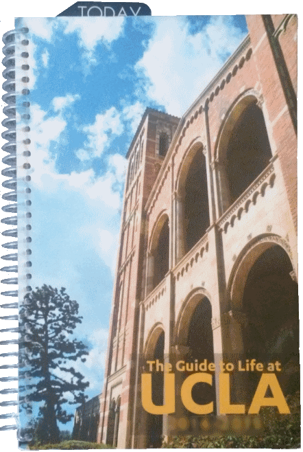

# Synopsis

*UCLA Online Planner* is a personal side project in development that creates a student planner as a Web application. The design of the planner is adopted from that of the student planner given to incoming UCLA freshmen at New Student Orientation and sold at the <a href="http://shop.uclastore.com/" target="_blank">UCLA Store</a>. The current planner can be viewed <a href="http://uclastudentplanner.apphb.com/login.aspx" target="_blank">here</a>.

# Development

This project uses the ASP.NET framework, and is hosted by AppHarbor.

The page-flipping animation of the planner is adopted from <a href="http://www.turnjs.com/" target="_blank">Turn.js</a>.

This Web application currently does not enable users to create their own accounts. If you wish to see the current functionality of the planner, please log into the site with username *guest* and password *guest*. 

# Installation

To compile and build this project, please use Microsoft Visual Studio Express for Web.
